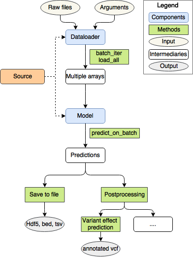

# Kipoi: Model zoo for genomics

[](https://circleci.com/gh/kipoi/kipoi)
[](https://gitter.im/kipoi/kipoi-feedback?utm_source=badge&utm_medium=badge&utm_campaign=pr-badge&utm_content=badge)


This repository implements a python package and a command-line interface (CLI) to access and use models from Kipoi-compatible model zoo's.


## Links

- [kipoi.org](http://kipoi.org) - Main website
- [kipoi.org/docs](http://kipoi.org/docs) - Documentation
- [github.com/kipoi/models](https://github.com/kipoi/models) - Model zoo for genomics maintained by the Kipoi team
  
## Installation

### 1. Install miniconda/anaconda

Kipoi requires [conda](https://conda.io/) to manage model dependencies.
Make sure you have either anaconda ([download page](https://conda.io/miniconda.html)) or miniconda ([download page](https://www.anaconda.com/download/)) installed. If you are using OSX, see [Installing python on OSX](http://kipoi.org/docs/using/04_Installing_on_OSX/).

### 2. Install Git LFS

For downloading models, Kipoi uses [Git Large File Storage](https://git-lfs.github.com/) (LFS). To install it on Ubuntu, run:

```bash
# on Ubuntu
curl -s https://packagecloud.io/install/repositories/github/git-lfs/script.deb.sh | sudo bash
sudo apt-get install -y git-lfs
git-lfs install
```

Alternatively, install it through conda:

```bash
conda install -c conda-forge git-lfs && git lfs install
```

### 3. Install Kipoi

Next, install Kipoi using [pip](https://pip.pypa.io/en/stable/):

```bash
pip install kipoi
```

#### Development

If you wish to develop `kipoi`, run instead:

```bash
conda install pytorch-cpu
pip install -e '.[develop]'
```

This will install some additional packages like `pytest`. You can test the package by running `py.test`. 

If you wish to run tests in parallel, run `py.test -n 6`.

## Quick start



### Python

List available models

```python
import kipoi

kipoi.list_models()
```

Hint: For an overview over the available models also check the [model overview](http://kipoi.org/groups/) on our website, where you can see example commands for how to use the models on the CLI, python and R.

Load the model from model source or local directory
```python
# Load the model from github.com/kipoi/models/rbp
model = kipoi.get_model("rbp_eclip/UPF1", source="kipoi") # source="kipoi" is the default

# Load the model from a local directory
model = kipoi.get_model("~/mymodels/rbp", source="dir")  
# Note: Custom model sources are defined in ~/.kipoi/config.yaml
```

Main model attributes and methods
```python
# See the information about the author:
model.info

# Access the default dataloader
model.default_dataloader

# Access the Keras model
model.model

# Predict on batch - implemented by all the models regardless of the framework
# (i.e. works with sklearn, Keras, tensorflow, ...)
model.predict_on_batch(x)

# Get predictions for the raw files
# Kipoi runs: raw files -[dataloader]-> numpy arrays -[model]-> predictions 
model.pipeline.predict({"dataloader_arg1": "inputs.csv"})
```

Load the dataloader
```python
Dl = kipoi.get_dataloader_factory("rbp_eclip/UPF1") # returns a class that needs to be instantiated
dl = Dl(dataloader_arg1="inputs.csv")  # Create/instantiate an object
```

Dataloader attributes and methods
```python
# batch_iter - common to all dataloaders
# Returns an iterator generating batches of model-ready numpy.arrays
it = dl.batch_iter(batch_size=32)
out = next(it)  # {"inputs": np.array, (optional) "targets": np.arrays.., "metadata": np.arrays...}

# To get predictions, run
model.predict_on_batch(out['inputs'])

# load the whole dataset into memory
dl.load_all()
```

Re-train the model
```python
# re-train example for Keras
dl = Dl(dataloader_arg1="inputs.csv", targets_file="mytargets.csv")
it_train = dl.batch_train_iter(batch_size=32)  
# batch_train_iter is a convenience wrapper of batch_iter
# yielding (inputs, targets) tuples indefinitely
model.model.fit_generator(it_train, steps_per_epoch=len(dl)//32, epochs=10)
```

For more information see: [nbs/python-api.ipynb](nbs/python-api.ipynb) and [docs/using getting started](http://kipoi.org/docs/using/01_Getting_started/)

### Command-line

```
$ kipoi
usage: kipoi <command> [-h] ...

    # Kipoi model-zoo command line tool. Available sub-commands:
    # - using models:
    ls               List all the available models
    predict          Run the model prediction
    pull             Download the directory associated with the model
    preproc          Run the dataloader and save the results to an hdf5 array
    postproc         Tools for model postprocessing like variant effect prediction
    env              Tools for managing Kipoi conda environments

    # - contribuing models:
    init             Initialize a new Kipoi model
    test             Runs a set of unit-tests for the model
    test-source      Runs a set of unit-tests for many/all models in a source
```

Explore the CLI usage by running `kipoi <command> -h`. Also, see [docs/using/getting started cli](http://kipoi.org/docs/using/01_Getting_started/#command-line-interface-quick-start) for more information.

### Configure Kipoi in `.kipoi/config.yaml`

You can add your own (private) model sources. See [docs/using/03_Model_sources/](http://kipoi.org/docs/using/03_Model_sources/).

### Contributing models

See [docs/contributing getting started](http://kipoi.org/docs/contributing/01_Getting_started/) and [docs/tutorials/contributing/models](http://kipoi.org/docs/tutorials/contributing_models/) for more information.

## Postprocessing

### SNV effect prediction

Functionality to predict the effect of SNVs is available in the API as well as in the command line interface. The input
is a VCF which can then be annotated with effect predictions and returned in the process. For more details on the requirements for the models and
 dataloaders please check [docs/using/02_Variant_effect_prediction](http://kipoi.org/docs/using/02_Variant_effect_prediction/)


## Documentation

Documentation can be found here: [kipoi.org/docs](http://kipoi.org/docs)
