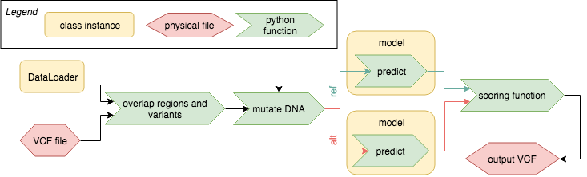
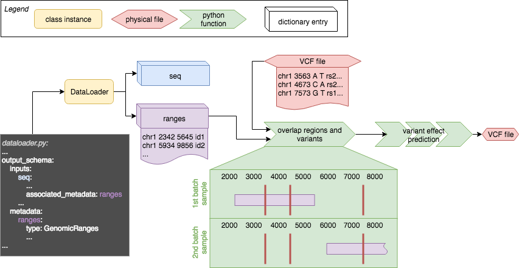
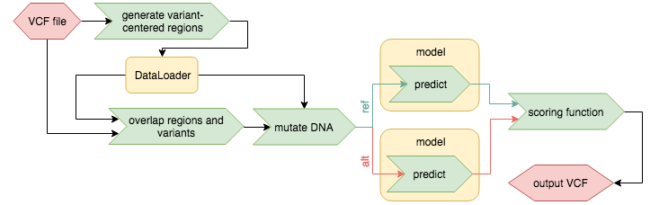
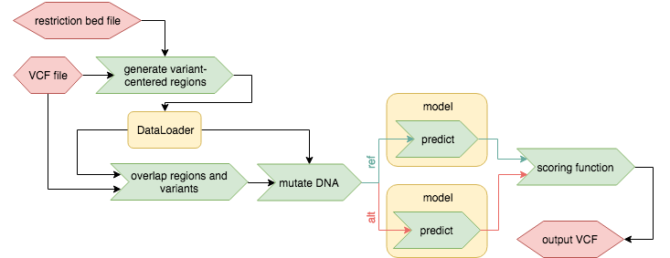
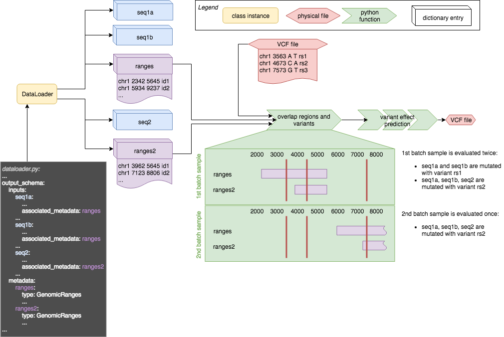

# Variant effect prediction
Variant effect prediction offers a simple way predict effects of SNVs using any model that uses DNA sequence as an input. Many different scoring methods can be chosen but the principle relies on in-silico mutagenesis (see below). The default input is a VCF and the default output again is a VCF annotated with predictions of variant effects.


## How it works
This sketch highlights the overall functionality of variant effect prediction. More details are given in the chapters below.



Dataloader output and a VCF are overlapped and the input DNA sequence is mutated as defined in the VCF. The reference and the alternative set of model inputs is predicted using the model and the differences are evaluated using a scoring function. The results are then stored in an annotated VCF.

## In-silico mutagenesis
The principle relies on generating model predictions twice, once with DNA sequence that contains the reference and once with the alternative allele of a variant. Those predictions can then be compared in different ways to generate an effect prediction.

### Scoring methods
Scoring methods that come with Kipoi are `Diff` which simply calculates the difference between the two predictions, `Logit` which calculates the difference of `logit(prediction)` of the two predictions and a few more. Those scoring methods can also be user-defined in which case they can be submitted with the model. Not all scoring functions are compatible with all model possible model outputs - for example the logit transformation can only be performed on values [0,1].

## Model and dataloader requirements
The model has to produce predictions at least partly based on DNA sequence and the DNA sequence either has to be as a string (e.g. `actgACTG`) or in a 1-hot encoded way in which A = `[1,0,0,0]`, C = `[0,1,0,0]`, T= `[0,0,1,0]`, G= `[0,0,0,1]`. Please note that any letter/base that is not in `actgACTG` will be regarded and treated as `N` (in one-hot: `[0,0,0,0]`)!

Requirements for the dataloader are that apart from producing the model input it also has to output information which region of the genome this generated sequence corresponds. On a side note: This region is only used to calculate an overlap with the query VCF, hence as long the dataloader output refers to the same sequence assembly as the VCF file variant scoring will return the desired results.

## Setting up the model.yaml
In order to indicate that a model is compatible with Kipoi postprocessing the definition of `postprocessing` in the model.yaml file is necessary. The postprocessing section can then mention multiple different ways to interpret a model. Here we will discuss variant effect prediction, a sample section of the model.yaml can look like this:

```yaml
postprocessing:
    variant_effects:
      seq_input:
        - seq
      use_rc: seq_only
```

This defines that the current model is capable to be used for variant effect prediction (`variant_effects`) and it defines that `seq` is the name of the model input that contains DNA sequence, which can be mutated and used for effect prediction. `seq_input` is a mandatory field and variant effect prediction can only be executed if there is at least one model input defined in `seq_input`. For some models it is necessary that also reverse-complements of DNA sequences are tested / predicted. To indicate that this is the case for the current model add the optional flag `use_rc: seq_only`. Using `seq_only` will reverse-complement *only* the model inputs that are defined in `seq_input`. Any other model input will remain untouched and exactly the same input will be fed to the model input as for the "forward" version of the model input.


As mentioned above the DNA sequence input may either be a string or 1-hot encoded. To indicate which format is used the `special_type` flag is used. The model input may then look like this:

```yaml
schema:
    inputs:
        seq:
            shape: (101, 4)
            special_type: DNASeq
            doc: One-hot encoded RNA sequence
```

Here a one-hot encoded sequence (`DNASeq`) is expected to be the model input. Note that the model input label (here: `seq`) was used before in the `postprocessing` section and the same label is expected to be exist in the dataloader output.

The `special_type` flag for using string input sequences is: `DNAStringSeq`. So the following snippet of a model.yaml file

```yaml
schema:
    inputs:
        seq:
            shape: ()
            special_type: DNAStringSeq
            doc: RNA sequence as a string
```

indicates that a single sample of `seq` is `np.array(string)` where `string` is a python string.

If `special_type` is not defined for a model input, but it is used in `seq_input` in the `postprocessing` section, then by default Kipoi expects one-hot encoded DNA sequences.


## Setting up the dataloader.yaml

Similar to the model.yaml also `dataloader.yaml`has to have a `postprocessing` section defined to indicate that it is compatible with variant effect prediction. As a bare minimum the following has to be defined:

```yaml
postprocessing:
    variant_effects:
```

And equally important every DNA sequence input of a model (here `seq`) has to have an associated metadata tag, which could like follows:

```yaml
output_schema:
    inputs:
        seq:
            shape: (101, 4)
            special_type: DNASeq
            doc: One-hot encoded RNA sequence
            associated_metadata: ranges
        some_other_input:
            shape: (1, 10)
            doc: Some description
    metadata:
        ranges:
            type: GenomicRanges
            doc: Ranges describing inputs.seq
```

Here the `associated_metadata` flag in the input field `seq` is set to `ranges`, which means that for every sample in the `model_input['inputs']['seq']` one entry in `model_input['metadata']['ranges']` is expected with its type either being `GenomicRanges` or a dictionary of numpy arrays with the keys `chr`, `start`, `end`, `id`. The information in the metadata object gives variant effect prediction the possibilty to find the relative position of a variant within a given input sequence. Hence the `associated_metadata` is mandatory for every  entry in `seq_input` in the model.yaml file. Please note that the coordinates in the metadata are expected to be 0-based, hence comply with .bed file format!

The following sketch gives an overview how the different tags play together and how they are used with variant effect prediction.




## Use-cases
This section describes a set of functions which cover most of the common queries for variant effect. All of the functions described below require that the model.yaml and dataloader.yaml files are set up in the way defined above.

In literature in-silico mutagenesis-based variant effect predcition is performed in a variant centric way: Starting from a VCF for every variant a sequence centered on said variant is generated. That sequence is then mutated by modifying the central base and setting it to what is defined as reference or alternative allele, generating two sets of sequences. For both the set with the reference allele in the center and the alternative allele in the center the model prediction is run and model outputs are compared.

Not all models can predict on aribrary DNA sequences from any region of the genome. Splicing models may for example only be trained on regions surrounding a splice site, hence the variant-centered approach from before will not work. Therefore two more options to run variant effect predicion are offered: restricted variant centered effect prediction and overlap-based effect prediction.

Variant effect prediction will try to use variant-centered approaches whenever the `bed_input` flag is defined in dataloader.yaml (see below). Otherwise the overlap-based effect prediction is used. This is because the variant centered approach is generally faster and for every variant in the VCF one single prediction can be made (assuming the position of variant is in a valid genomic region).

For all the methods described below it is essential that genomic coordinates in the VCF and the coordinates used by the dataloader are for the same genome / assembly /etc.

### Variant centered effect prediction
In order to use variant centered effect prediction the dataloader must accept an input bed file based on which it will produce model input. Furthermore the dataloader is required to return the name values (fourth column) of the input bed file in the `id` field of `model_input['metadata']['ranges']`. Additionally the order of samples has to be identical with the order of regions in the input bed file, but regions may be skipped.

In order for the variant effect prediction to know which input argument of the dataloader is accepts a bed file three additional lines in dataloader.yaml are necessary, e.g:

```yaml
postprocessing:
    variant_effects:
      bed_input:
        - intervals_file
```

This section indicates that the dataloader function has an argument `intervals_file` which accepts a bed file path as input which may be used.




### Restricted-variant centered effect prediction
Requirements for the dataloader and dataloader.yaml here are identical to the variant centered effect prediction. The only difference is that this function is designed for models that can't predict on arbitrary regions of the genome, but only in certain regions of the genome. If those regions can be defined in a bed file (further on called 'restriction-bed' file) then this approach can be used. Variant effect prediction will then intersect the VCF with the restriction-bed and generate another bed file that is then passed on to the dataloader.

Regions in the restriction-bed file may be larger than the input sequence lenght, in that case the generated seuqence will be centered on the variant position as much as possible - restricted by what is defined in the restrictions-bed file.


### Overlap-based effect prediction
If the dataloader does not support bed input files then variant effect predictions can be run by the overlap of a VCF with the regions defined in the metdata output of the dataloader.

If multiple variants overlap with a region then the effect will be predicted inpendently for those variants. If multiple (e.g.: two) model input samples overlap with one variant then the output will contain as many predictions as there were independent overlaps of metadata ranges and variants (e.g.: two).


## Scoring functions
After mutating the model input DNA sequences predictions are created using the models and those predictions then have to compared by scoring methods. Not all scoring methods are compatible with all models depending on the output data range of the model (see below). The compatibility of a scoring function with a given model can be indicated by setting `scoring_functions` in model.yaml:

```yaml
postprocessing:
   variant_effects
	  seq_input:
	    - seq
	  scoring_functions:
	    - name: diff
	      type: diff
	    - type: logit
	      default: true
```

The scoring function is identified by the `type` field in `scoring_functions` which is the only mandatory field. Allowed values for the `type` field are: `diff`, `logit`, `deepsea_effect` and `custom`.

Setting `default:true` for a scoring function indicates that that respective scoring function is executed by variant effect prediction if none is selected by the used on execution time. If multiple scoring functions have set `default:true` then all of those will be run by default. If `default:true` is not set for any scoring function defined in `scoring_functions` then all entries in `scoring_functions` will be run by default.


Scoring functions can be assigned a different name with the `name` flag by which they are then selected using the command line interface. In general it is not advisable to rename the scoring functions that come with Kipoi.


#### Diff
The simplest scoring method is to calculate the difference between predictions for the reference and the alternative allele: `prediction(alt) - prediction(ref)`. This scoring method is available for all models no matter if it is defined in `scoring_functions` or not.

#### Logit
Calculates the difference of logit-transformed values of the predictions:
`logit(prediction(alt)) - logit(prediction(ref))`. This scoring method only makes sense if the model output can be interpreted as probabilities. In a wider sense, it will only produce valid values if the predictions are in the range [0,1].

#### LogitAlt
Returns the logits transformed predictions for the sequences carrying the alternative allele:
`logit(prediction(alt))`. This scoring method only makes sense if the model output can be interpreted as probabilities. In a wider sense, it will only produce valid values if the predictions are in the range [0,1].

#### LogitRef
Returns the logits transformed predictions for the sequences carrying the reference allele:
`logit(prediction(ref))`. This scoring method only makes sense if the model output can be interpreted as probabilities. In a wider sense, it will only produce valid values if the predictions are in the range [0,1].

#### Deepsea_effect
Calculates the variant scores as defined in the publication of the DeepSEA model (Troyanskaya et al., 2015) by using the absolute value of the logit difference and diff values multiplied together: `abs(Logit * Diff)` with `Logit` and `Diff` defined as above.

#### Custom
Custom scoring methods can be defined and shipped with the models. In that case the model.yaml will look similar to this:

```yaml
postprocessing:
  variant_effects:
    seq_input:
      - seq
    scoring_functions:
      - name: my_scores
        type: custom
        defined_as: postproc.py::myfun
        args:
          first_arg:
            doc: Description of the first argument
            default: 1
```

Notice that the selection of `type: custom` requires that `defined_as` is set. The value `postproc.py::myfun` indicates that the callable python object `myfun` is stored in a file called `postproc.py`. When executing variant effect prediction in the command line the scoring function can be chosen by it's name - which in this case is: `my_scores`.

All scoring functions are subclasses of `Rc_merging_pred_analysis` this means that also a custom scoring function must inherit from it.


## Output
The output of variant effect prediction is by default stored in a VCF that is derived from the input VCF. The output VCF only contains variants for which a effect prediction could be generated (e.g. if no model input sample overlapped a variant no prediction could be made for it). The predictions themselves are stored in the INFO field of the VCF, with the ID starting with `KPVEP` and containing the name of the model. Additional to the predictions themselves a also a region ID will be stored in a second INFO field. The region IDs are the values stored in `model_input['metadata']['ranges']['id']` given to a sequence sample generated by the dataloader. This way it is possible to trace back which sequence was mutated by which variant in order to produce a certain effect prediction

Since multiple seqeunces generated by the dataloader may overlap one variant - especially when using the overlap-based effect prediction - it is possible that the generated VCF output will contain a variant multiple times, but the different predictions will be destinguishable by their region ID.

If variant effect prediction is run programmatically in python then the results are returned as a dictionary of pandas DataFrames.


## More complex models
More complex models may have more than only one DNA sequence input, it may even be that models have DNA sequence inputs taken from different regions of the genome within one sample in a batch. See this sketch for an illustration of the scenario:




The dataloader has three sequence outputs which are linked to two metadata ranges. for both ranges objects the beginning of the ranges is displayed. In order to overlap the metadata ranges with variants the input batch is processed one sample at a time. The samples in a batch are displayed in green rectangular boxes: For every sample all the ranges are assembled and overlapped with variants in the VCF. Then the effect is predicted for every single variant in the VCF that overlaps at least one of the region defined in that sample. This means that for the first sample in the batch two variants are investigated: rs1 and rs2. rs1 can only affect seq1a and seq1b, hence those two sequences are mutated, seq2 is not. rs2 overlaps with both ranges in the first sample and hence two sequences are mutated with rs2 to predict its effect. This means that the first sample will be evaluated twice using variants rs1 and rs2, and the second sample only once using rs3.
